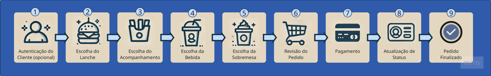

# Pós Tech Software Architecture - FIAP

Organização elaborada pelos alunos [@AlvaroVianello](https://github.com/alvarovianello) e [@WilliamMarques](https://github.com/https://github.com/WilliaMarques7) em 2025, para unificar os repositórios do projeto FastFood para o "Tech Challenge" do curso Pós Tech Software Architecture da FIAP.

## Objetivo
O projeto foi desenvolvido para resolver um problema recorrente na implementação de sistemas de lanchonetes: a gestão eficiente de pedidos.

O sistema permitirá a gestão de clientes, produtos, categorias e principalmente possibilitar o cliente realizar pedidos de lanches, acompanhamentos, bebidas e sobremesas.

O processo de pagamento será por QR Code, gerado pela integração com a plataforma [Mercado Pago]([https://github.com/alvarovianello](https://www.mercadopago.com.br/home)).

## Fases do Projeto

  
FASE 1

  
FASE 2

### - 1 Atualizar a aplicação desenvolvida na FASE 1 refatorando o código para seguir os padrões Clean Code e Clean Architecture:
#### Alterar/criar as APIs

- [x] Checkout do pedido: deverá receber os produtos solicitados e retornar a identificação do pedido;
- [x] Consultar status do pagamento do pedido: informando se o pagamento foi aprovado ou não (incluindo cancelado).
- [x] Webhook: para receber confirmação de pagamento aprovado ou recusado;
- [x] A lista de pedidos deverá retorná-los com suas descrições, ordenados com a seguinte regra:
  - [x] 1. Pronto > Em Preparação > Recebido;
  - [x] 2. Pedidos mais antigos primeiro e mais novos depois;
  - [x] 3. Pedidos com status Finalizado não devem aparecer na lista.
- [x] Atualizar o status do pedido;
- [x] Opcionalmente, Como desafio extra (opcionalmente), você pode implementar a integração com Mercado Pago para gerar o QRCode para pagamento e integrar com o WebHook para capturar os pagamentos.
- ~~[ ] Caso contrário, será necessário realizar o mock da parte de pagamentos. Como referência, acesse: https://www.mercadopago.com.br/developers/pt/docs/qr-code/integration-configuration/qr-dynamic/integration.~~

### - 2 Criar uma arquitetura em Kubernetes que atenda os seguintes requisitos
#### Alterar/criar as APIs

- [x] Os requisitos funcionais descritos nos itens anteriores (item problema).
- [x] Escalabilidade com aumento e diminuição de Pods conforme demanda (HPA). 
- [x] Seguir boas práticas de segurança, utilizando ConfigMap e Secrets para valores sensíveis. 
- [x] A lista de pedidos deverá retorná-los com suas descrições, ordenados com a seguinte regra:
- [x] Seguir boas práticas de arquitetura, sempre utilizando Deployment e Service para expor a aplicação. 

### - 3 Entrega da seguinte documentação no ReadMe
#### Documentação

- [x] Desenho da arquitetura pensado por você, pessoa arquiteta de software, contemplando:
  - [x] - i. Os requisitos do negócio (problema).
  - [x] - ii. Os requisitos de infraestrutura:
    - Você pode utilizar o MiniKube, Docker Kubernetes, AKS, EKS, GKE ou qualquer nuvem que você desenha.
- [x] Collection com todas as APIs desenvolvidas:
  - [x] i. Link do Swagger no projeto ou link para download da collection do Postman (JSON).
- [x] Guia completo com todas as instruções para execução do projeto e a ordem de execução das APIs, caso seja necessário;
- [x] Link para vídeo demonstrando a arquitetura desenvolvida na nuvem ou localmente, evidenciando o funcionamento dos endpoints (API) e a infra criada.

  
FASE 3

  TODO

  
FASE 4

  TODO

## Stack utilizada

- **Linguagem de Programação:** .NET 8, C#
- **Documentação e uso de API's:** Swagger
- **Banco de dados:** PostgresSQL

## Gerenciador de cluster
- **Conteinerização:** Docker
- **Orquestração:** Kubernetes

## Arquitetura
A aplicação está estruturada no padrão de _Clean Architecture_.

## Autores
- [@alvarovianello](https://github.com/alvarovianello)
- [@WilliaMarques7](https://github.com/https://github.com/WilliaMarques7)
| Nome | RM | GitHub |
| --- | --- | --- |
| Álvaro da Silva Olivera | RM354879 | [@alvarovianello](https://github.com/alvarovianello) |
| William Alves Marques | RM354876 | [@WilliaMarques7](https://github.com/https://github.com/WilliaMarques7) |
